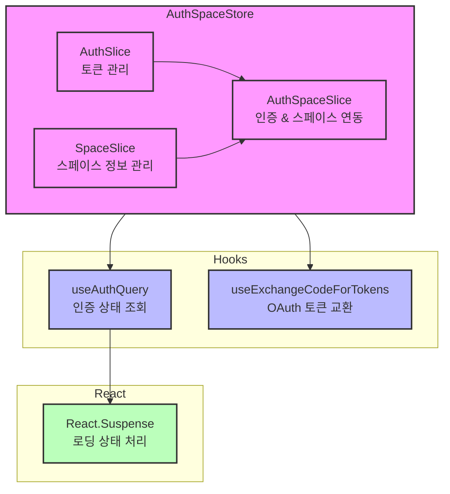

# 인증 시스템 아키텍처

## 컴포넌트 구조

## 데이터 흐름 설명

1. **인증 상태 관리**
   - `AuthSlice`: 액세스 토큰, 리프레시 토큰 관리
   - `SpaceSlice`: 스페이스 정보, 관리 스페이스 목록 관리
   - `AuthSpaceSlice`: 인증과 스페이스 정보를 연동하여 관리

2. **훅을 통한 접근**
   - `useAuthQuery`: 인증 상태를 조회하고 Suspense와 연동
   - `useExchangeCodeForTokens`: OAuth 로그인 처리 및 스페이스 정보 저장

3. **React Suspense 연동**
   - `useAuthQuery`가 로딩 상태일 때 Suspense를 통해 처리
   - 인증 상태가 준비될 때까지 대기

## 주요 기능

1. **토큰 관리**
   - 액세스 토큰, 리프레시 토큰 저장
   - 토큰 갱신 및 만료 처리

2. **스페이스 정보 관리**
   - 사용자의 스페이스 목록 관리
   - 관리 권한이 있는 스페이스 필터링

3. **OAuth 로그인**
   - 디스코드 OAuth 로그인 처리
   - 로그인 시 스페이스 정보 자동 저장
